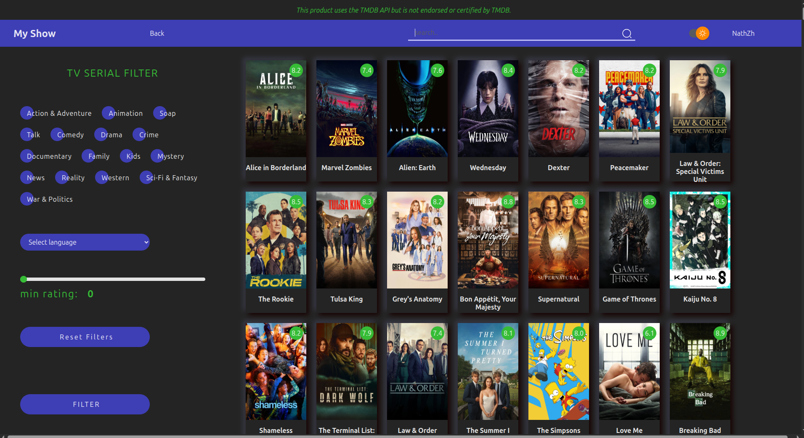

# My Show



## Beschreibung
"My Show" ist eine Webanwendung für TV-Serien-Enthusiasten. Sie ermöglicht es Nutzern, alle TV-Shows aus der TMDB-Datenbank zu durchsuchen, persönliche Watchlists zu verwalten, Episoden und Staffeln als gesehen zu markieren, aktuell laufende oder abgebrochene Serien zu verfolgen und vieles mehr. Eine Registrierung ist erforderlich, um alle Funktionen zu nutzen. Der Hauptfokus des Projekts liegt auf der Nutzung einer Drittanbieter-API (TMDB).

## Funktionen
- TV-Shows aus der TMDB-Datenbank durchsuchen
- Serien zur persönlichen Watchlist hinzufügen/entfernen
- Gesehene Episoden und Staffeln verfolgen
- Aktuell laufende oder abgebrochene Serien verwalten
- Filter nach Genre und Sprache
- Farbmodus (dunkel/hell) wechseln
- Benutzerregistrierung und Anmeldung erforderlich
- Responsives und sauberes UI

## Live-Vorschau
Sie können das Projekt hier ansehen: [Vercel Vorschau](#) *(Autorisierung erforderlich, Link wird hinzugefügt)*

## Installation
1. Repository klonen:
```bash
git clone <repo-url>
