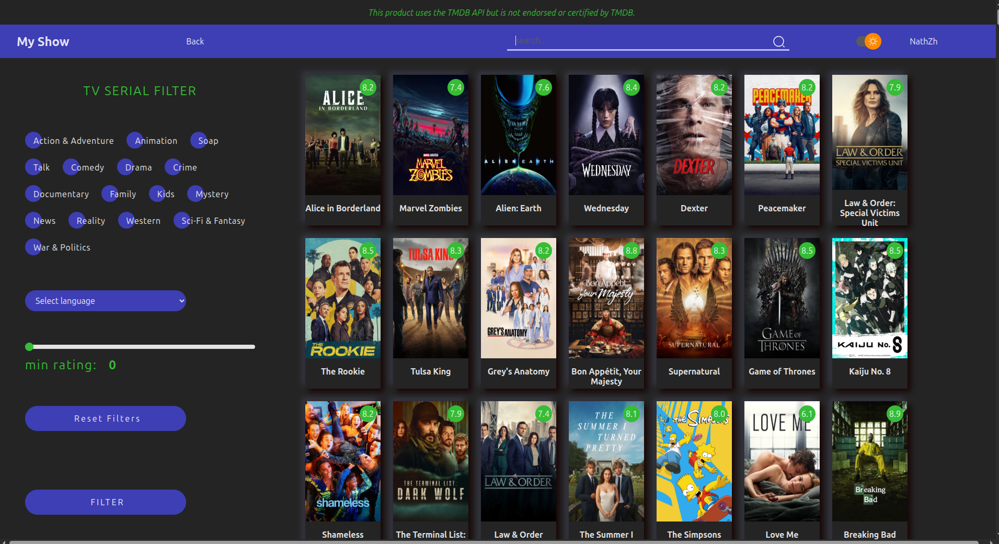

# My Show



## Description
"My Show" is a web application for TV series enthusiasts. It allows users to browse all TV shows from the TMDB database, manage personal watchlists, mark episodes and seasons as watched, track currently watching, started but abandoned shows, and more. Registration is required to access full features. The main focus of the project is the usage of a third-party API (TMDB).

## Features
- Browse TV shows from TMDB database
- Add/remove shows to your personal watchlist
- Track watched episodes and seasons
- Manage shows currently watching or abandoned
- Filter by genre and language
- Color scheme toggle (dark/light)
- User registration and login required
- Responsive and clean UI

## Live Preview
You can view the deployed project here: [Vercel Preview](#) *(authorization required, link will be added)*

## Installation
1. Clone the repository:
```bash
git clone <repo-url>
